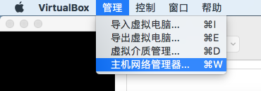

# Mac 环境下使用 VirtualBox 部署 Ubuntu 18.04私有云

## 材料准备

本文使用配置为Intel(R) Core(TM) i5-5250U CPU @ 1.60GHz，内存8GB 的 MacBook Air 机器在 macOS 环境下安装。

VirtualBox 版本为5.2.18，文中远程桌面访问需额外安装 VirtualBox Extension Pack 扩展。

Ubuntu Server 18.04.1 LTS镜像：https://www.ubuntu.com/download/server/thank-you?version=18.04.1&architecture=amd64

## 安装过程

### 1-新建虚拟机

安装 VirtualBox 后新建虚拟机，程序向导已足够清晰，这里不再赘述。

###2-配置虚拟网卡

创建虚拟机后点击左上角管理->主机网络管理器



打开管理器后新建虚拟网卡，输入所需要的配置，这一步的目的是要使宿主机通过虚拟网卡的设置来连接至虚拟机：


经过这一步后，在终端中输入命令`ifconfig` （Windows 下为`ipconfig`）应当可以看到一个刚才所配置的网卡：


配置完虚拟网卡后，在虚拟机的设置界面->网络中，配置网卡1为NAT 方式，网卡2为Host-Only，并连接刚才所创建的虚拟网卡：


接着，点击网卡1->高级->端口转发打开配置窗口，窗口中填入网卡的地址和虚拟机的 ip 地址，端口为 ssh 默认需要使用到的22号端口，若有需要修改了 ssh 配置根据实际情况填入即可。


### 3-安装系统

网卡配置完成，接下来使用镜像启动系统安装，根据屏幕上指引步骤完成后重启进入系统

### 4-配置虚拟机系统网络

进入系统后进行网卡2的配置，在 Ubuntu 17.10后已改为使用 netplan 进行配置：

先输入`sudo netplan generate` 生成配置，然后修改`/etc/netplan/50-cloud-init.yaml`文件输入配置内容：


```yaml
network:
    ethernets:
        enp0s3:
            addresses: []
            dhcp4: true
        enp0s8:
            addresses:
            - 192.168.100.101/24
            dhcp4: false
            nameservers:
                addresses: []
                search: []
    version: 2
```


保存退出后输入`sudo netplan apply` 应用配置。

此时在 macOS 终端使用`ssh xxx.xxx.xxx.xxx(虚拟机 ip) -l user(用户名)`命令即可使用 ssh 连接至虚拟机使用。

### 5- apt 换源

ssh 进入系统后先将在国内连接速度较慢的 ubuntu 官方源替换为速度较好的中科大源：

首先备份源的信息文件: ` sudo mv /etc/apt/sources.list /etc/apt/sources.list.backup` 

然后使用 vim 编辑文件：`sudo vim /etc/apt/sources.list` ，输入以下内容：

```
##中科大源

deb https://mirrors.ustc.edu.cn/ubuntu/ bionic main restricted universe multiverse
deb-src https://mirrors.ustc.edu.cn/ubuntu/ bionic main restricted universe multiverse
deb https://mirrors.ustc.edu.cn/ubuntu/ bionic-updates main restricted universe multiverse
deb-src https://mirrors.ustc.edu.cn/ubuntu/ bionic-updates main restricted universe multiverse
deb https://mirrors.ustc.edu.cn/ubuntu/ bionic-backports main restricted universe multiverse
deb-src https://mirrors.ustc.edu.cn/ubuntu/ bionic-backports main restricted universe multiverse
deb https://mirrors.ustc.edu.cn/ubuntu/ bionic-security main restricted universe multiverse
deb-src https://mirrors.ustc.edu.cn/ubuntu/ bionic-security main restricted universe multiverse
deb https://mirrors.ustc.edu.cn/ubuntu/ bionic-proposed main restricted universe multiverse
deb-src https://mirrors.ustc.edu.cn/ubuntu/ bionic-proposed main restricted universe multiverse
```

完成后输入`:wq` 保存退出，执行`sudo apt update` 和`sudo apt upgrade` 完成换源。

### 6-配置远程桌面连接

本次安装的为 Ubuntu 服务器系统，只配置了命令行界面，若有需求也可配置 桌面环境，使用 VirtualBox扩展进行远程桌面服务。

首先，需要从https://www.virtualbox.org/wiki/Downloads下载对应版本的Oracle VM VirtualBox Extension Pack，安装后重启宿主机。

然后，到虚拟机设置的显示->远程桌面下选择启用服务器，输入配置的内容，这里就只使用了默认的3389端口：


完成后下一步是在虚拟机中安装桌面环境，只需要使用`sudo apt install ubuntu-desktop` 命令即可安装 GNOME桌面环境。因为使用 VirtualBox 的远程桌面功能，所以不需要再在虚拟机中配置远程桌面服务。

完成上述配置后，在 Mac 下需要到 App Store 下载微软发布的Microsoft Remote Desktop应用（似乎中国大陆区的 App Store 中没有，需要使用美区账号）。

在 Microsoft Remote Desktop 应用中，输入虚拟网卡的 ip:端口，以及登录的用户名后即可进行连接：


连接后效果如图：


**以上即为在 Mac 环境下使用 VirtualBox 安装 Ubuntu 18.04 虚拟服务器的过程**


## 友情链接

1. [Win10环境下安装配置VirtualBox，搭建Ubuntu私有云](https://palette25.github.io/2018/09/08/Serive-Computing-Install-Personal-Cloud/)

2. [Win10环境下安装配置VirtualBox，搭建CentOS私有云](<https://krazymud.github.io/2018/09/09/vbox-cfg/>)